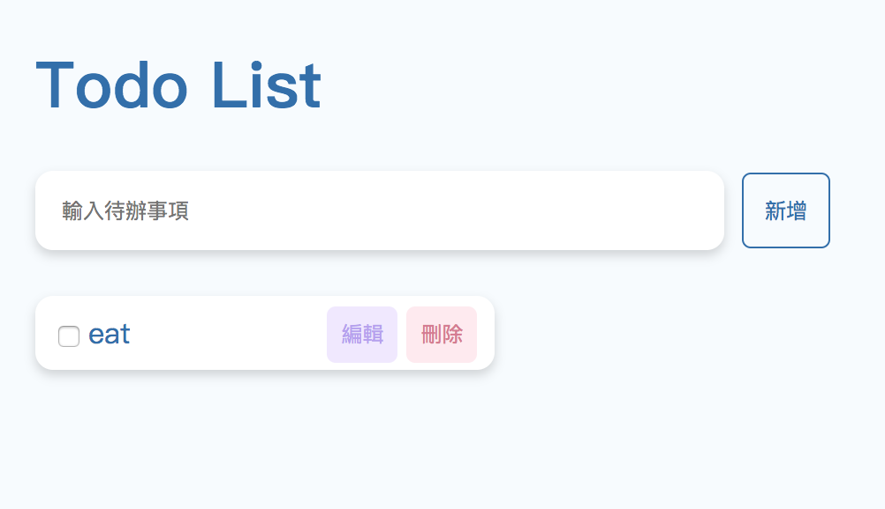

# Trunk-Studio Interview Test


## GET START
```npm start ```
## Features
1. Add todo
2. Edit todo
3. Delete todo

## Available Scripts
In the project directory, you can run:

Runs the app in the development mode.<br>
Open [http://localhost:3000](http://localhost:3000) to view it in the browser.


